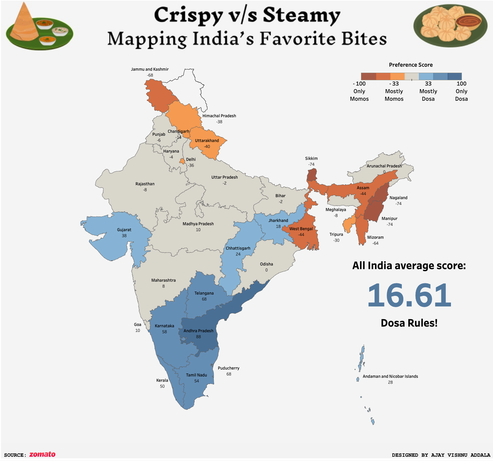

# Dosa vs Momos Demand Analysis in India (July 2023 - June 2024)

 <!-- Replace with actual image path -->

This project showcases a state-wise comparison of demand for Dosa and Momos across India using data from **Zomato Trends** ([Zomato Trends](https://www.zomato.com/trends/)), collected from July 2023 to June 2024. The dashboard, created in Tableau, visualizes how food preferences vary regionally, highlighting which states lean toward Dosa or Momos.

The project is inspired by Ashris’s *India in Pixels* ([Instagram Link](https://www.instagram.com/india.in.pixels/?hl=en)), which creatively visualizes data-driven stories about India.

## 📊 Dashboard Overview

The dashboard explores:
- **Demand Percentage by State**: Displays the demand for Dosa and Momos across all Indian states and union territories.
- **Normalized Score**: Each state has a normalized score, where a positive score indicates a higher preference for Dosa, and a negative score indicates a higher preference for Momos.
- **Weighted Average Demand for India**: The dashboard calculates an overall preference score for the country based on each state's demand percentage.

[**View the Tableau Dashboard on Tableau Public**](https://public.tableau.com/views/DosavsMomosTheIndianbattleofflavors/DosaVsMomos?:language=en-US&:sid=&:redirect=auth&:display_count=n&:origin=viz_share_link) <!-- Replace with actual link -->

## 📂 Repository Contents

This repository includes:
- **`Dosa_vs_Momos_Data.xlsx`**: The raw dataset of demand percentages for Dosa and Momos by state, sourced from Zomato Trends.
- **`Dosa_vs_Momos_Dashboard.twbx`**: The Tableau workbook containing the dashboard visualization.
- **`README.md`**: Project documentation.

## 🗂 Dataset Details

- **Source**: Zomato Trends ([Link](https://www.zomato.com/trends/))
- **Data Period**: July 2023 - June 2024
- **Data Fields**:
  - **Location**: The state or union territory in India.
  - **Demand%: Dosa**: Percentage of food orders that are Dosa in each location.
  - **Demand%: Momos**: Percentage of food orders that are Momos in each location.
  - **Normalized Score**: Calculated based on each state’s preference, with a positive score indicating Dosa preference and a negative score indicating Momo preference.

## 📈 Analysis Summary

The dashboard reveals:
- States with a strong preference for **Dosa** (e.g., Andhra Pradesh, Karnataka, and Tamil Nadu).
- States with a strong preference for **Momos** (e.g., Manipur, Sikkim, and Nagaland).
- A calculated **weighted average score** for India, providing an overall sense of national preferences.

## 🚀 How to Use

1. Download the repository.
2. Open **`Zomato Food trends.xlsx`** for raw data.
3. Use **`Dosa_vs_Momos_Dashboard.twbx`** to view the Tableau dashbo
